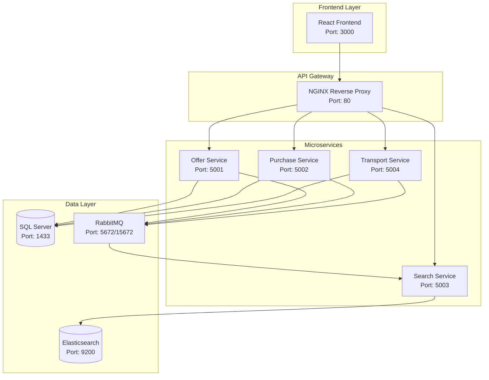
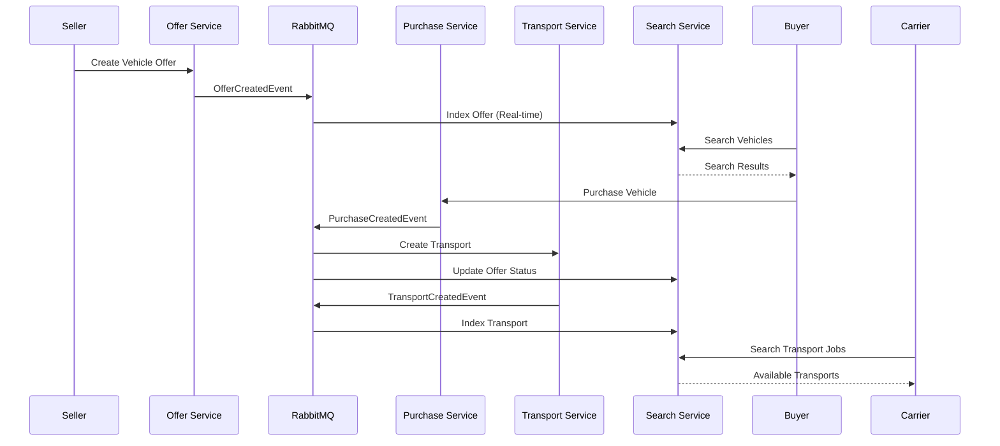

# 🚗 Automotive Marketplace Platform


A complete **event-driven microservices platform** for automotive marketplace operations, featuring universal search, real-time event processing, and role-based user interfaces. Built with .NET 8, React 18, Elasticsearch 8.12, and comprehensive Docker orchestration.

## 🏗️ Platform Architecture

### System Overview


### Event-Driven Flow


## 🚀 Quick Start

### One-Command Setup
```bash
# Clone and start entire platform
git clone <repository>
cd offer-service

# Start all services (includes auto-setup)
./start-platform.ps1

# Or use Docker Compose
docker-compose -f docker-compose-full.yml up -d
```

### Service Accessibility
After startup, access services at:

| Service | URL | Description |
|---------|-----|-------------|
| **Frontend** | http://localhost:3000 | React user interface |
| **Search API** | http://localhost:5003 | Universal search endpoint |
| **Offer API** | http://localhost:5001 | Vehicle offer management |
| **Purchase API** | http://localhost:5002 | Purchase transactions |
| **Transport API** | http://localhost:5004 | Transport logistics |
| **Elasticsearch** | http://localhost:9200 | Search engine |
| **RabbitMQ Management** | http://localhost:15672 | Message broker UI |
| **SQL Server** | localhost:1433 | Database server |

### Health Check
```bash
# Verify all services are running
curl http://localhost:5003/health
curl http://localhost:5001/health
curl http://localhost:5002/health
curl http://localhost:5004/health
```

## 🔍 Core Features

### Universal Search System
- **Multi-Entity Search**: Search across offers, purchases, transports simultaneously
- **Role-Based Results**: Sellers see their offers, Buyers see available vehicles
- **Real-Time Indexing**: Sub-second search updates via event streams
- **Advanced Filtering**: Price ranges, vehicle specifications, location-based
- **Auto-Complete**: Intelligent suggestions with fuzzy matching
- **Contextual Ranking**: Results optimized per user role

### Event-Driven Architecture
- **MassTransit Integration**: Reliable message processing with RabbitMQ
- **Event Sourcing**: Complete audit trail of all transactions
- **Real-Time Updates**: Instant UI updates via event streams
- **Error Handling**: Automatic retries and dead letter queues
- **Cross-Service Communication**: Decoupled microservice interactions

### Role-Based Access Control
- **Seller Portal**: Manage vehicle listings, track sales performance
- **Buyer Interface**: Browse marketplace, purchase history
- **Carrier Dashboard**: Transport logistics, route optimization
- **Agent Console**: System administration, comprehensive reporting

## 🛠️ Technology Stack

### Backend Services (.NET 8)
- **FastEndpoints**: High-performance minimal APIs
- **Entity Framework Core**: ORM with SQL Server
- **MassTransit**: Message bus integration
- **Elasticsearch.Net**: Search engine client
- **Serilog**: Structured logging
- **FluentValidation**: Request validation
- **AutoMapper**: Object mapping

### Frontend Application (React 18)
- **TypeScript**: Type-safe JavaScript
- **Vite**: Fast build tool and dev server
- **Tailwind CSS**: Utility-first styling
- **React Query**: Data fetching and caching
- **React Router**: Client-side navigation
- **Axios**: HTTP client library

### Infrastructure & Data
- **Elasticsearch 8.12**: Full-text search engine
- **SQL Server**: Relational database
- **RabbitMQ**: Message broker
- **Docker**: Containerization
- **NGINX**: Reverse proxy and load balancer

## 📊 Service Documentation

### Individual Service READMEs

| Service | Documentation | Key Features |
|---------|---------------|--------------|
| **[Offer Service](README_OFFER.md)** | Vehicle offer management | CRUD operations, VIN validation, event publishing |
| **[Purchase Service](../purchase-service/README.md)** | Purchase transactions | Order processing, payment integration, event consumption |
| **[Transport Service](../transport-service/README.md)** | Logistics management | Route planning, carrier assignment, delivery tracking |
| **[Search Service](../search-service/README.md)** | Universal search API | Elasticsearch integration, role-based filtering, autocomplete |
| **[Frontend Application](../centralized-search-frontend/README.md)** | User interface | React SPA, responsive design, role-based UI |

### API Documentation

Each service provides comprehensive Swagger documentation:
- **Offer Service**: http://localhost:5001/swagger
- **Purchase Service**: http://localhost:5002/swagger  
- **Transport Service**: http://localhost:5004/swagger
- **Search Service**: http://localhost:5003/swagger

## 🔧 Development Setup

### Prerequisites
- **Docker Desktop**: For containerized development
- **.NET 8 SDK**: For local service development
- **Node.js 18+**: For frontend development
- **Visual Studio 2022** or **VS Code**: IDE
- **SQL Server Management Studio**: Database management

### Local Development
```bash
# Start infrastructure services
docker-compose up -d elasticsearch rabbitmq sqlserver

# Start individual services for debugging
cd AI.OfferService.Api && dotnet run
cd ../purchase-service && dotnet run
cd ../transport-service && dotnet run  
cd ../search-service && dotnet run

# Start frontend
cd ../centralized-search-frontend && npm run dev
```

### Docker Development
```bash
# Full platform with hot reload
docker-compose -f docker-compose.dev.yml up -d

# Individual service development
docker-compose up -d offer-service
docker-compose logs -f offer-service
```

## 📈 Performance & Scalability

### Load Testing Results
```bash
# Run comprehensive load tests
cd automation-scripts
python load_test_search.py  # 1000+ concurrent searches
python load_test_offers.py  # 500+ concurrent offer operations
```

### Performance Metrics
- **Search Response Time**: < 50ms (95th percentile)
- **API Throughput**: 1000+ requests/second per service
- **Event Processing**: < 10ms end-to-end latency
- **Database Performance**: Optimized indexes, query optimization
- **Memory Usage**: < 512MB per service container

### Scaling Strategy
```yaml
# docker-compose.scale.yml
version: '3.8'
services:
  offer-service:
    deploy:
      replicas: 3
  search-service:
    deploy:
      replicas: 5
  nginx:
    deploy:
      replicas: 2
```

## 🔐 Security Features

### Authentication & Authorization
- **JWT Token-based**: Secure API access
- **Role-Based Access Control**: Field-level permissions
- **API Rate Limiting**: Prevent abuse
- **Input Validation**: Comprehensive request sanitization
- **CORS Configuration**: Secure cross-origin requests

### Data Protection
- **Encryption at Rest**: Database and Elasticsearch
- **TLS/SSL**: All service communication
- **Secret Management**: Environment-based configuration
- **Audit Logging**: Complete activity tracking
- **GDPR Compliance**: Data anonymization capabilities

## 🧪 Testing Strategy

### Automated Testing
```bash
# Unit tests
dotnet test --collect:"XPlat Code Coverage"

# Integration tests  
dotnet test --filter Category=Integration

# E2E tests
cd automation-scripts && python run_e2e_tests.py

# Load tests
python load_test_platform.py
```

### Test Coverage
- **Unit Tests**: 85%+ code coverage
- **Integration Tests**: Complete API endpoint coverage
- **E2E Tests**: Critical user journey validation
- **Load Tests**: Performance regression prevention

## 🚢 Deployment Options

### Production Deployment
```bash
# Build production images
docker-compose -f docker-compose.prod.yml build

# Deploy to production
docker-compose -f docker-compose.prod.yml up -d

# Health verification
./scripts/verify-deployment.sh
```

### Cloud Deployment
- **Azure Container Instances**: Managed container hosting
- **AWS ECS/EKS**: Kubernetes orchestration
- **Google Cloud Run**: Serverless containers
- **Docker Swarm**: Multi-node orchestration

### Monitoring & Observability
```bash
# Add monitoring stack
docker-compose -f docker-compose.monitoring.yml up -d

# Access dashboards
# Grafana: http://localhost:3001
# Prometheus: http://localhost:9090
# Jaeger: http://localhost:16686
```

## 📚 Data Management

### Database Schema
```sql
-- Core entities across services
Offers (Id, VehicleId, SellerId, Price, Status, CreatedAt)
Vehicles (Id, VIN, Make, Model, Year, Mileage)
Purchases (Id, OfferId, BuyerId, PurchasePrice, Status)
Transports (Id, PurchaseId, CarrierId, PickupLocation, DeliveryLocation)
```

### Event Schema
```json
{
  "OfferCreatedEvent": {
    "offerId": "int",
    "vehicleDetails": { "vin": "string", "make": "string" },
    "sellerId": "string",
    "price": "decimal",
    "timestamp": "datetime"
  },
  "PurchaseCreatedEvent": {
    "purchaseId": "int", 
    "offerId": "int",
    "buyerId": "string",
    "timestamp": "datetime"
  },
  "TransportCreatedEvent": {
    "transportId": "int",
    "purchaseId": "int", 
    "carrierId": "string",
    "locations": { "pickup": "string", "delivery": "string" }
  }
}
```

### Data Seeding
```bash
# Generate test data for development
cd automation-scripts
python generate_test_data.py --offers 1000 --purchases 500 --transports 200

# Load sample data
python load_sample_data.py
```

## 🤝 Contributing

### Development Workflow
1. **Fork & Clone**: Create personal fork
2. **Feature Branch**: `git checkout -b feature/your-feature`
3. **Development**: Follow coding standards
4. **Testing**: Write comprehensive tests
5. **Documentation**: Update relevant READMEs
6. **Pull Request**: Submit with clear description

### Code Standards
```bash
# .NET formatting
dotnet format

# Frontend linting
npm run lint

# Code analysis
dotnet sonarscanner begin /k:"automotive-marketplace"
dotnet build
dotnet sonarscanner end
```

## 🆘 Troubleshooting

### Common Issues

**Services not starting:**
```bash
# Check Docker resources
docker system prune -f
docker-compose down
docker-compose up -d

# Verify port availability
netstat -an | findstr "5001 5002 5003 5004"
```

**Search not working:**
```bash
# Verify Elasticsearch health
curl http://localhost:9200/_health

# Rebuild search index
curl -X POST http://localhost:5003/api/search/reindex
```

**Event processing issues:**
```bash
# Check RabbitMQ status
docker logs rabbitmq
# Access management UI: http://localhost:15672
```

### Performance Issues
```bash
# Monitor resource usage
docker stats

# Check service logs
docker-compose logs -f search-service

# Database performance
# Check slow queries in SQL Server Management Studio
```

### Getting Help
- **GitHub Issues**: Report bugs and feature requests
- **Wiki Documentation**: Detailed technical guides
- **Community Discord**: Real-time development chat
- **Stack Overflow**: Tag questions with `automotive-marketplace`

---

## 🎯 Next Steps

### Immediate Actions
1. **Follow Quick Start**: Get platform running locally
2. **Explore APIs**: Use Swagger documentation
3. **Test Search**: Try role-based search scenarios
4. **Review Code**: Examine service implementations

### Advanced Usage
1. **Custom Development**: Add new services or features
2. **Performance Tuning**: Optimize for your data volume
3. **Integration**: Connect with external systems
4. **Monitoring Setup**: Implement production observability

**🚀 Ready to explore the automotive marketplace? Start with the [Quick Start](#quick-start) guide above!**